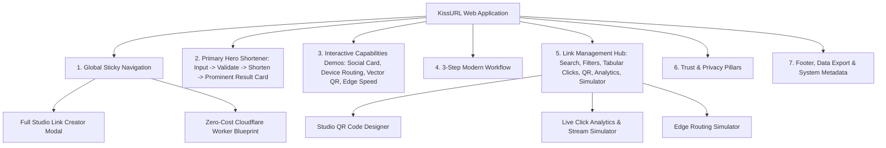

# KissURL Product Architecture & Requirements (PRODUCT.md)

## 1. Product Purpose & Philosophy
KissURL is a modern, high-performance link intelligence and URL shortening platform. It is engineered around a clear contextual information architecture:

> **Right Feature + Right Information + Right Moment.**

- **Public Visitors / Landing**: Immediately encounter the primary URL shortening engine as the hero.
- **Link Managers / Power Users**: Discover and access rich capabilities (Dynamic OpenGraph Social Previews, Smart Device Routing, Studio Vector QR Codes, and Real-Time Privacy Analytics) seamlessly through contextual triggers and dedicated studio surfaces.

---

## 2. Complete Information Architecture & Surface Hierarchy

---

## 3. All Product Capabilities Preserved & Implemented

| Capability | Public Landing Context | Deep Studio / Management Context |
| :--- | :--- | :--- |
| **URL Shortening** | Primary hero action with natural validation & protocol auto-formatting. | Full 5-tab creation studio with custom domain, alias, and smart rules. |
| **Social Card Studio (OG Meta Tags)** | Interactive live preview demo dock for Twitter/X, LinkedIn, WhatsApp & Slack. | In-depth metadata editor override for custom card title, description, and preview image. |
| **Smart Device Routing** | In-line toggle in hero for iOS & Android targets; interactive device simulator dock. | Deep link configuration modal + full Edge routing simulator. |
| **Studio QR Code Designer** | Direct trigger on result card and link cards. | High-res vector SVG and PNG downloads with brand color customization & error correction. |
| **Real-time Analytics** | Subordinated below primary action; tabular click badges. | Dedicated visual dashboard with click timeline, referrers, device/OS split, geo split, and live event ingestion simulator. |
| **Security & Expiration** | Passcode protection & burn-after-clicks. | Configurable per link with fallback routing and password unlock gates. |
| **Data Portability** | Subdued footer triggers. | 1-Click CSV & JSON backup exports. |
| **$0 Production Architecture** | Navigation button & footer link. | Complete Cloudflare Worker edge script and KV namespace deployment blueprint. |

---

## 4. Design System & Zoom Standards
- **Color Balance (60/30/10)**: 60% Neutral base (`--bg-canvas: #f8fafc`, `--bg-surface: #ffffff`), 30% Slate structure (`--text-primary: #0f172a`, `--border-subtle: #e2e8f0`), 10% Cobalt accent (`--accent-primary: #2563eb`).
- **Default Theme**: Light Mode by default, with accessible Dark Mode toggle.
- **Dynamic Zoom**: 80% to 200% zoom resilience using relative `rem` units and responsive flex wrapping.
- **Accessibility**: AA/AAA contrast compliance, touch targets $\ge 44\text{px}$, visible `:focus-visible` focus rings.
