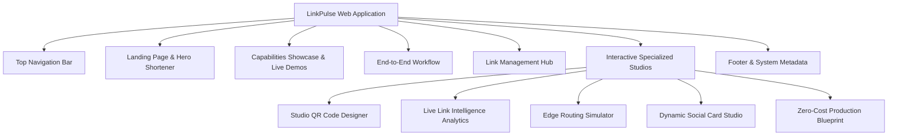
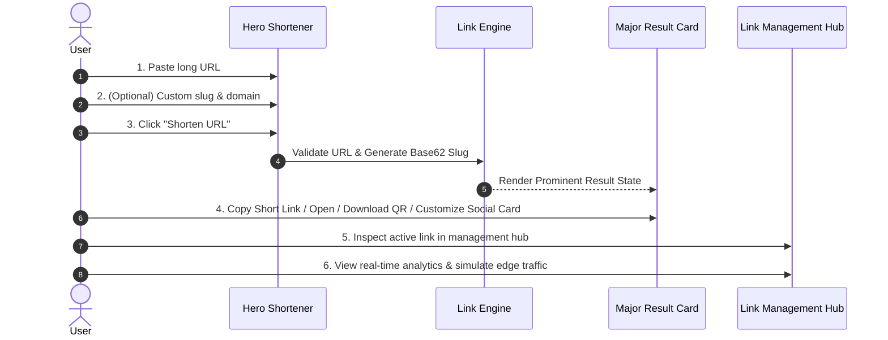

# LinkPulse Product Architecture & Requirements (PRODUCT.md)

## 1. Product Purpose & Value Proposition
LinkPulse is an intelligent, high-performance link management platform designed for content creators, growth marketers, engineering teams, and modern developers. It replaces legacy bloated tools (Bitly/TinyURL) with a fast, privacy-first, zero-monthly-cost edge architecture ($0/mo).

---

## 2. Information Architecture & Navigation

---

## 3. End-to-End User Journey (The Primary Flow)

---

## 4. State Matrix for URL Shortening Interaction

| State | Visual Behavior | Interactive Actions |
| :--- | :--- | :--- |
| **1. Empty** | Placeholder visible, clean neutral input, Shorten button enabled. | User can type or paste URL. |
| **2. Typing / Populated** | Clear icon appears, URL scheme auto-validated. | User can pick custom domain, enter custom alias, or click auto-generate slug. |
| **3. Validating / Loading** | Input locked, subtle spinner in button with "Shortening...". | Prevents double submissions. |
| **4. Success (Major Result)** | Result panel expands with short URL, 1-click copy, QR generator button, social preview button, test redirect button, and "Shorten Another" button. | User can immediately copy or further customize smart rules. |
| **5. Error** | High-contrast error message explaining issue (e.g., "Invalid URL format" or "Alias already in use") with quick fix suggestions. | User can edit input without losing other form fields. |

---

## 5. Responsive & Zoom Requirements
- **Viewport range**: 320px (mobile) to 4K ultra-wide.
- **Browser zoom**: Fully resilient from 80% to 200% zoom without clipping or breaking inputs/buttons.
- **Touch Targets**: Minimum 44px on mobile devices.
