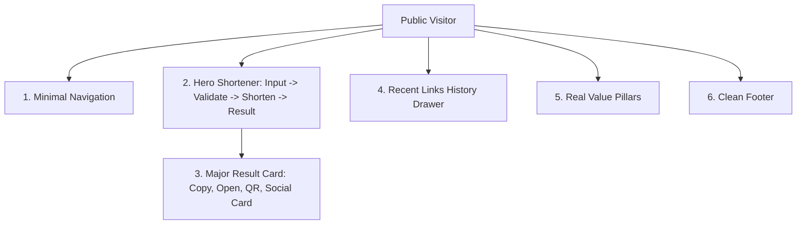

# KissURL Product Architecture & Requirements (PRODUCT.md)

## 1. Product Purpose & Philosophy
KissURL (**Keep It Simple Short URL**) is a fast, public-facing URL shortening service. It is designed to perform one core job flawlessly:

> **Paste a long link → Shorten it → Copy and use the clean short URL.**

Secondary capabilities (custom aliases, QR codes, link history, analytics, OpenGraph customization) are available contextually without cluttering the primary user journey.

---

## 2. Information Architecture



---

## 3. Core Shortening Workflow

```
1. Visitor arrives on https://kiss.url
2. Immediate clarity: Headline & URL Input field
3. Paste long URL (e.g. https://github.com/my-project)
4. (Optional) Expand "Customize alias & options"
5. Click "Shorten"
6. Major Result Card appears:
   - Large Short URL (https://kiss.url/my-slug)
   - 1-Click "Copy Link" (instant confirmation)
   - "Open" in new tab
   - "QR Code" generator trigger
7. Link is automatically saved to "Recent Links" below
```

---

## 4. Navigation & Public Experience Guidelines
- **No fake marketing fluff**: No fake enterprise logos, no fake user numbers, no fake 5-star badges.
- **No dashboard clutter on public homepage**: Link history and analytics are subordinated below the primary action.
- **Dynamic Zoom & Mobile Readiness**: Fully operational from 80% to 200% zoom with accessible $\ge 44\text{px}$ touch targets.
